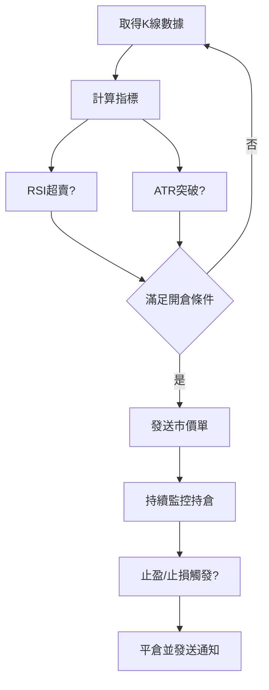

# Bitunix 量化交易系統

## 核心交易策略
### 多因子決策模型

## 已實現功能詳情

本交易機器人目前已實現以下核心功能：

1.  **進場信號**：
    *   **RSI 反轉進場**：當 RSI 指標上穿預設的超賣閾值 (RSI_BUY) 時觸發多單進場信號。
    *   **突破進場**：當最新收盤價突破前 BREAKOUT_LOOKBACK 根 K 線的最高價時觸發多單進場信號。

2.  **出場信號**：
    *   **RSI 平倉**：當持有多單且 RSI 指標下穿預設的平倉閾值 (EXIT_RSI) 時觸發平倉信號。

3.  **風險管理**：
    *   **ATR 止損止盈 (針對 RSI 進場)**：對於由 RSI 信號觸發的進場，會根據入場價格和當前 ATR 值設置固定的止損 (入場價 - ATR * STOP_MULT) 和止盈 (入場價 + ATR * LIMIT_MULT) 訂單。
    *   **移動止損 (針對突破進場)**：對於由突破信號觸發的進場，機器人會手動追蹤價格，並在價格朝有利方向移動時，將止損價格逐步提高至 (當前收盤價 - ATR * STOP_MULT)。

**重要提示**：Bitunix API 的 Position TP/SL 端點目前不直接支持設置移動止損訂單。因此，突破進場的移動止損邏輯是在機器人程式碼中手動計算並通過修改現有止損訂單來實現的。




**策略參數對照表**
| 參數名稱 | 預設值 | 計算方式 | 生效條件 |
|----------|--------|----------|----------|
| RSI周期 | 14 | Wilder's MA法 | <30 超賣區域 |
| ATR周期 | 20 | 真實波動幅度均值 | 突破3倍ATR |
| 止盈比例 | 150% | (入場價+2.5*ATR) | 市價單觸發 |

## 即時通知系統
### Discord 訊息流水線
1. 交易事件觸發(開倉/平倉/警報)
2. 生成mplfinance OHLC圖表
3. 附加持倉狀態數據表
4. 透過Webhook發送Embed訊息
```python
# 圖表生成範例
mpf.plot(df, type='candle', style='binance',
         title='BTC/USDT 15min',
         volume=True,
         savefig='trade_chart.png')
```

## 系統快速安裝及啟動
可直接在資料夾執行start.bat自動安裝依賴套件及啟動機器人
## 系統安裝指南
### 1. Python环境配置
#### 1.1 安装Python 3.11+
1. 访问[Python官网](https://www.python.org/downloads/)下载Windows安装包
2. 安装时务必勾选 "Add Python to PATH"
3. 验证安装：
```powershell
python --version
pip --version
```

#### 1.2 配置虚拟环境
```powershell
# 创建虚拟环境
python -m venv .venv
# 激活环境
.venv\Scripts\Activate.ps1
# 退出环境命令
deactivate
```

### 2. 依赖库安装
#### 2.1 安装TA-Lib
1. 下载预编译包(重要！)：
```powershell
pip download TA-Lib --platform win_amd64 --python-version 3.11 --only-binary=:all:
```
2. 安装依赖：
```powershell
pip install -r requirements.txt
```

#### 2.2 加速安装(可选)
```powershell
pip config set global.index-url https://pypi.tuna.tsinghua.edu.cn/simple
```

### 3. 启动脚本优化
```bat
@echo off
SETLOCAL

:: 检查Python环境
where python >nul 2>&1
if %ERRORLEVEL% neq 0 (
    echo 错误: Python未正确安装或未加入PATH
    pause
    exit /b 1
)

:: 激活虚拟环境
if exist .venv\Scripts\activate.bat (
    call .venv\Scripts\activate.bat
) else (
    echo 正在创建虚拟环境...
    python -m venv .venv
    call .venv\Scripts\activate.bat
)

:: 安装依赖
pip install -r requirements.txt
if %ERRORLEVEL% neq 0 (
    echo 错误: 依赖安装失败，请检查网络连接
    pause
    exit /b 1
)

:: 运行主程序
python trading_bot.py

ENDLOCAL
```

### 4. 常见错误排查
| 错误现象 | 解决方案 |
|---------|---------|
| TA-Lib安装失败 | 1. 安装VC++ 14.0构建工具<br>2. 从[非官方编译包](https://www.lfd.uci.edu/~gohlke/pythonlibs/#ta-lib)下载whl文件手动安装 |
| 虚拟环境激活失败 | 以管理员身份运行 PowerShell，执行：`Set-ExecutionPolicy RemoteSigned` |
| 依赖冲突 | 删除.venv文件夹后重建虚拟环境 |
| API连接超时 | 1. 检查防火墙设置<br>2. 验证系统时间准确性 |

### 配置文件参数说明
| 参数组 | 参数名称 | 类型 | 必填 | 默认值 |
|--------|----------|------|------|--------|
| 交易所  | api_key | str | ✓ | 无 |
| 交易所  | api_secret | str | ✓ | 无 |
| 策略参数 | rsi_period | int | ✓ | 14 |
| 通知设置 | discord_webhook | str | ✓ | 无 |

